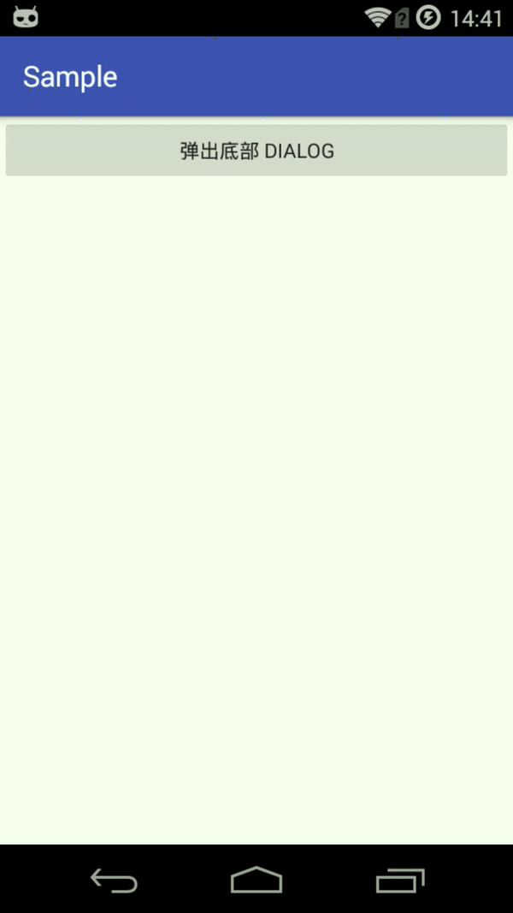

# BottomDialog
仿 iOS 从底部弹出 Dialog

## 效果



## 使用方法
1.gradle
```
compile 'com.github.zackratos.bottomdialog:bottomdialog:1.0.0'
```

2.自定义 DialogFragment 继承自 BottomDialog,重写 createView 方法
```java
public class SampleDialog extends BottomDialog {

    @Override
    protected View createView(LayoutInflater inflater, ViewGroup container) {
        View view = inflater.inflate(R.layout.dialog_sample, container, false);
        view.findViewById(R.id.cancel_button).setOnClickListener(new View.OnClickListener() {
            @Override
            public void onClick(View view) {
                dismiss();
            }
        });
        return view;
    }
}
```


## License
```
Copyright 2017 Zackratos

Licensed under the Apache License, Version 2.0 (the "License");
you may not use this file except in compliance with the License.
You may obtain a copy of the License at

    http://www.apache.org/licenses/LICENSE-2.0

Unless required by applicable law or agreed to in writing, software
distributed under the License is distributed on an "AS IS" BASIS,
WITHOUT WARRANTIES OR CONDITIONS OF ANY KIND, either express or implied.
See the License for the specific language governing permissions and
limitations under the License.
```